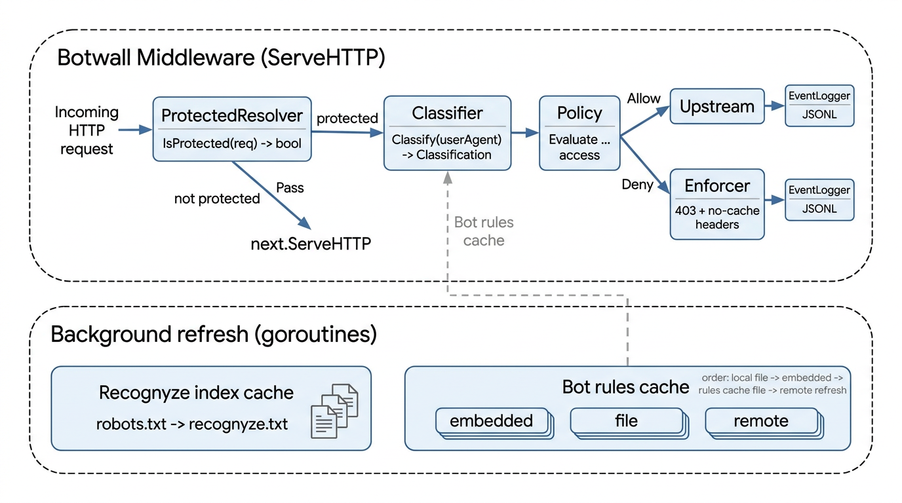

# botwall Architecture

This document explains the plugin architecture, what each file is responsible for, and the runtime workflow.

## 1) Architecture Overview

`traefik_bot_wall` (`module github.com/recognyze-ai/traefik-bot-wall`) is a Traefik middleware plugin designed for catalog publication that enforces bot access policy for protected resources.

Core design goals:

- Keep request-time decisions fast (in-memory policy and protected-path checks).
- Avoid per-request remote fetches (cache + proactive background refresh).
- Enforce the bot wall behavior (category policy, bot overrides, exact 403 contract).
- Optional **IP softmax** when portal bot rules include `ipVerification` and `enableIPSoftmax` is enabled.
- Optional **trusted proxy CIDRs** so forwarded client IP headers are not honored from untrusted TCP peers.
- Keep observability explicit (structured decision logs in combined-log shape with source metadata where applicable).

### Main Runtime Components

1. **Middleware Entry (`Botwall`)**
   - Intercepts incoming requests.
   - Checks whether the path is protected.
   - Resolves client IP via `extractClientIP` (optional `trustedProxyCIDRs`; see `trusted_proxy.go` / `utils.go`).
   - Classifies traffic: **UA softmax + IP verification** when `enableIPSoftmax` and portal `ipVerification` data exist (`softmax.go`); otherwise UA/category classification only (`classifier.go`).
   - May **deny early** (403) on softmax gate (e.g. spoofed UA vs published IP ranges) before category policy.
   - Evaluates hierarchical policy for remaining allow path.
   - Either blocks with exact 403 response or forwards to upstream.

2. **Protected Resource Resolver**
   - Determines which paths are protected.
   - Uses discovery precedence:
     1) configured `recognyzeURL`
     2) `robots.txt` `Recognyze:` directive fallback.
   - Maintains cached protected-path index with proactive refresh.

3. **Bot Rules Classifier**
   - Loads rules from optional `botRulesFile` override when configured.
   - Falls back to embedded default bot rules bundled with the plugin source.
   - Optionally refreshes from remote `botRulesURL` (defaults to production `DefaultBotRulesURL` in `config.go` when omitted; set `botRulesURL` to `disabled` to turn off remote fetch).
   - Parses portal/API JSON including optional `{ "bot_rules": { ... } }` wrapper and **`ipVerification.bots`** (see `botdef_parse.go`).
   - Tracks rule source (`local_file`, `default_file`, `remote_fresh`, `remote_cached_fallback`).
   - Produces normalized classification data for policy evaluation.
   - Keeps classify hot-path reads lock-light (`RWMutex` read lock for snapshots; write lock only when rotating defs/refresh state).

4. **Policy Evaluator**
   - Applies hierarchical category rules (longest-prefix).
   - Applies per-bot overrides.
   - Returns final allow/deny decision + reason.

5. **Enforcer + Logger**
   - On deny: emits the exact 403 contract.
   - On allow: records the upstream response status via a response wrapper for accurate `signed_visit` logging.
   - Logs both blocked and allowed protected requests as structured JSONL events. The client IP is emitted in the **`remote_logname`** field (Apache combined–style); see `logging.go`.
   - Optionally ships accumulated `application/jsonl` records to the Recognyze portal at `publisherLogsURL` (authenticated with the live secret from `PublisherKeyManager`) on a timer and after writes (see `CONFIGURATION.md`).

6. **Publisher API key manager** (`publisher_api_key.go`, `publisher_key_crypto.go`)
   - Loads bootstrap `publisherAPIKey` from Traefik config; persists rotated secrets in `publisherAPIKeyStateFile` (YAML is never rewritten).
   - Proactive rotation before `expiration_date` (default 14-day buffer): metadata sync via `GET .../api-keys/current/`, rotate via `PUT ...?op=rotate`.
   - Optional AES-256-GCM encryption at rest for the state-file secret.
   - Enabled by default when `publisherLogsURL` is set; opt out with `publisherAPIKeyRotationEnabled: false` for manual key management.

## 2) File Responsibilities

### Plugin Runtime

- `main.go`
  - Plugin entrypoint (`New`) and request handling (`ServeHTTP`).
  - Wires resolver, classifier, softmax gate, policy evaluator, enforcer, and logger.
  - Passes `trustedProxyNets` into client IP extraction; constructs `PublisherKeyManager`, starts rotation loop and event log shipping when configured.

- `config.go`
  - Middleware configuration schema.
  - Defaults (`24h` protected-path TTL, `1h` pre-expiry refresh, `5m` event-ship interval when logging is used, production default `botRulesURL`, softmax weights `4`/`4`).
  - Validation and normalization of config values (including trusted proxy CIDR parsing, publisher logs/rotation/encryption settings, and shared `allowInsecureBotRulesURL` for dev HTTP URLs).

- `defaults.go`
  - Loads baseline default bot rules from `defaultBotDef.json`.

- `defaultBotDef.json`
  - Baseline default bot rules JSON loaded at startup as `default_file`.

- `resolver.go`
  - Protected-path resolution from `recognyze.txt`.
  - `robots.txt` discovery (`Recognyze:` directive).
  - Cache state model (`fetchedAt`, `expiresAt`, `nextRefreshAt`, `etag`, `lastModified`).
  - Async refresh scheduling and persistence of cache snapshot.

- `classifier.go`
  - Bot definition structures and loading pipeline.
  - UA matching via `ua_patterns`, fallback category pattern matching.
  - Optional remote rules refresh and local cache fallback.
  - Classification output (`matched`, `ruleCategory`, `trafficCategory`, `botSlug`).

- `botdef_parse.go`
  - Parses portal/API bot-rules JSON (including `bot_rules` envelope) and builds `ipVerification` runtime index from `ipVerification.bots`.

- `trusted_proxy.go`
  - Parses `trustedProxyCIDRs` into `*net.IPNet` list; `ipInAnyNet` for peer checks.

- `softmax.go`
  - UA+IP softmax (`ClassifyForBotWall`), CIDR matching, anti-spoof gates before policy when enabled.

- `policy.go`
  - Category wall and per-bot overrides.
  - Canonical category path normalization.
  - Longest-prefix evaluation logic.
  - Final policy decision model used by middleware.

- `enforce.go`
  - Exact 403 response contract:
    - status `403`
    - required no-cache and robots headers
    - fixed block message body.

- `logging.go`
  - Structured JSONL event model for decisions (`plugin_name`, `protected_source`, `cache_status`, `rule_source`, etc.).
  - User-agent sanitization (control characters stripped, max length) before logging.
  - File append logger with write locking; optional first-line export metadata for portal/decision-log imports.
  - Optional background and on-write **publisher logs ship**: POST `application/jsonl` body (one `AccessLogEvent` JSON object per line, plus the metadata envelope as the first line) to `publisherLogsURL` with header `X-API-KEY: <publisherAPIKey>`; truncate file on HTTP 2xx.

- `http_utils.go`
  - HTTP fetch helpers with conditional request headers (`If-None-Match`, `If-Modified-Since`).
  - Shared helpers for request scheme and remote rule fetch.

- `utils.go`
  - Utility helpers (`slugify`), **client IP extraction** (`extractClientIP` with optional trusted CIDR list), JSON file persistence, fallback helpers.

### Plugin Metadata and Runtime Environment

- `.traefik.yml`
  - Traefik plugin catalog metadata (display name, import path, summary, test data).

- `docker-compose.yaml`
  - Local Traefik stack (`traefik:v3.6`) for plugin development and validation.
  - Enables both Docker provider and file provider.
  - File provider is configured with:
    - `--providers.file.directory=/etc/traefik/dynamic`
    - `--providers.file.watch=true`
  - Mounts:
    - `./traefik/dynamic` into Traefik as `/etc/traefik/dynamic` (read-only)
    - `./` into Traefik as `/plugins-local/src/github.com/recognyze-ai/traefik-bot-wall` for local plugin runtime loading
    - `./fixtures` for optional local integration fixtures
    - `./logs` to `/var/log/traefik` (decision log path in dynamic YAML)
  - Exposes Traefik web on host port `80` and the API/dashboard on host port `5051` (Traefik’s internal `8080`).
  - Sample service `myapp` uses `traefik/whoami` with host `myapp.localhost` and middleware `r7e@file`, load-balanced to `http://host.docker.internal:8000`.

- `traefik/dynamic/botwall.yml`
  - Current source-of-truth middleware configuration for the `botwall` plugin in local dev.
  - Loaded by Traefik file provider (`--providers.file.filename`).

- `fixtures/botdef.json`
  - Optional local test fixture for bot rules in integration/dev runs.
  - Not required for default plugin operation because embedded defaults are available.

- `traefik.md`
  - Operational quick-start and manual verification instructions.

- `go.mod`
  - Go module definition for tests/build.

### Tests

- `config_test.go`
  - Config defaults and validation tests (including `publisherLogsURL` / `publisherLogsInterval` rules and the require-`publisherAPIKey`-when-URL-set check).

- `logging_test.go`
  - Decision log metadata header and event-ship behavior tests.

- `classifier_test.go`
  - Covers embedded defaults, local-file precedence, cache fallback precedence, and explicit local-preferred startup mode.

- `resolver_test.go`
  - `robots.txt` parsing and `recognyze.txt` path parsing tests.

- `policy_test.go`
  - Longest-prefix category behavior and bot override behavior tests.

- `enforce_test.go`
  - 403 response contract tests.

- `utils_test.go`
  - Trusted vs untrusted peer client IP extraction.

- `softmax_test.go`
  - UA+IP softmax anti-spoof and match cases.

#### Running Tests (Useful Variants)

From the plugin module directory:

`.`

- Run all tests:
  - `go test ./...`
- Run all tests with verbose output:
  - `go test -v ./...`
- Run coverage for the module:
  - `go test -cover ./...`
- Run only config-related tests (targets `config_test.go` test names by regex):
  - `go test -v -run Config .`

## 3) Workflow (How It Works)

## 3.1 Request Decision Workflow

1. Request enters Traefik on the `web` entrypoint (local: host port `80`, for example `http://localhost/`) and matches a router rule (sample stack: host `myapp.localhost`).
2. Router applies middleware `r7e@file` defined in `traefik/dynamic/botwall.yml`.
3. Middleware executes `botwall` package request decision logic.
4. Middleware asks resolver if request path is protected.
   - If not protected: pass through immediately.
5. If protected:
   - Resolve **client IP** using `extractClientIP` with optional `trustedProxyCIDRs` (see §3.5).
   - If **`enableIPSoftmax`** and bot rules expose `ipVerification` data, run **`ClassifyForBotWall`** (softmax + UA-only rejection against published ranges; see §3.6). On gate **deny**, return 403 without category policy.
   - Else classify UA via standard classifier (`Classifier.Classify`).
   - Policy engine evaluates category wall and bot overrides.
6. Decision:
   - **Deny** -> return exact 403 contract, log `blocked_visit` (status `403` in the event).
   - **Allow** -> forward to upstream, log `signed_visit` with the **upstream** HTTP status captured after the response.

## 3.2 Protected Resource Discovery Workflow

1. Resolver determines resource URL by precedence:
   - configured `recognyzeURL` first
   - else parse `robots.txt` for `Recognyze:` directive.
2. Resolver fetches `recognyze.txt`, parses protected paths, updates cache state.
3. Resolver stores snapshot to disk for restart continuity.

## 3.3 Cache Refresh Workflow (Smart Refresh)

1. On cache update:
   - set `expiresAt = fetchedAt + cacheTTL` (default 24h)
   - set `nextRefreshAt = expiresAt - refreshBeforeExpiry` (default 1h early)
2. On requests:
   - use in-memory cache for decisions.
   - if `now >= nextRefreshAt`, trigger one async refresh (single in-flight).
3. Refresh uses conditional HTTP when possible (ETag/Last-Modified).
4. If refresh fails:
   - keep serving last known good cache.
   - schedule retry via next refresh window/backoff behavior.

## 3.4 Bot Rules Workflow

1. Load baseline defaults from `defaultBotDef.json` as the hard baseline (`default_file`).
2. If `botRulesFile` is configured, attempt to load it from disk.
   - On success, it overrides embedded defaults (`local_file`).
   - On failure, log and keep embedded defaults.
3. If **`botRulesURL` is enabled** (omit → production **`DefaultBotRulesURL`**; `disabled` / `none` / `off` → no remote sync) and `rulesCacheFile` is readable, load cached remote rules only when cache is not older than `botRulesFile` (`remote_cached_fallback`).
   - Set `preferLocalBotRulesFile=true` to force local startup precedence when both local and cache are present.
   - Startup now emits explicit logs describing whether cache or local file won precedence.
4. If **`botRulesURL` is enabled**, start periodic background refresh to remote rules (`remote_fresh` on success).
   - `https://` is required by default; `http://` is allowed only when `allowInsecureBotRulesURL` is explicitly enabled for development.
   - Remote fetches use a bounded HTTP client timeout to avoid hanging refresh goroutines.
5. On successful remote refresh, persist the new rules to `rulesCacheFile` and (when configured) to `botRulesFile`.
   - Persistence uses write-to-temp then rename for crash-safe snapshot updates.
6. If remote rules refresh fails, keep the last in-memory/cached state.

Remote JSON may use a `{ "bot_rules": { ... } }` envelope from the Recognyze portal API and includes **`ipVerification.bots`** (vendor UA patterns plus `ipRanges`) for optional softmax enforcement.

## 3.5 Trusted client IP extraction

1. Parse the TCP peer IP from **`req.RemoteAddr`**.
2. If **`trustedProxyCIDRs`** is **non-empty** and the peer falls in those networks: honor **`CF-Connecting-IP`**, then **`X-Forwarded-For`** (first parseable hop), then **`X-Real-IP`**. Otherwise **ignore** those headers and use **`RemoteAddr`** only so untrusted clients cannot spoof forwarded IPs.
3. If **`trustedProxyCIDRs`** is **empty** (legacy compatibility): forwarded headers may still influence the resolved client IP; operators should configure CIDRs for spoof-resistant enforcement (see **`CONFIGURATION.md`**).

## 3.6 IP softmax (optional)

When **`enableIPSoftmax`** is **`true`** and loaded rules expose **`ipVerification.bots`** with IP ranges, the plugin runs UA+IP **softmax** attribution in **`softmax.go`**: weights **`softmaxAlpha`** / **`softmaxBeta`** (default **`4`** / **`4`**), **`winner_requires_verified_ip`** handling, and optional rejection of UA-only claims when softmax mode expects verified IPs.

## 3.7 Publisher logs shipping (optional)

1. When `publisherLogsURL` is set (and `publisherAPIKey` non-empty — startup fails fast otherwise), `New` starts a ticker loop at `publisherLogsInterval` that attempts to ship and truncate.
2. Each `Log` call may also trigger a ship (rate-limited by `publisherLogsInterval` since the last ship) after appending an event line.
3. Ship payload is the log file body as `application/jsonl` (metadata line plus event lines, one JSON object per line). The request carries `X-API-KEY: <publisherAPIKey>` and `Accept: application/json`.
4. The Recognyze portal endpoint at `/publisher/logs/` accepts the shipped `application/jsonl` body and an alternative single JSON array payload; both map to the same per-record schema (`AccessLogEvent` field-for-field).
5. On HTTP 2xx, the file is truncated; on failure, events remain for a later attempt. The HTTP client timeout for ship requests is fixed (15 seconds in code).

Details and security notes for URL scheme: `CONFIGURATION.md`.
